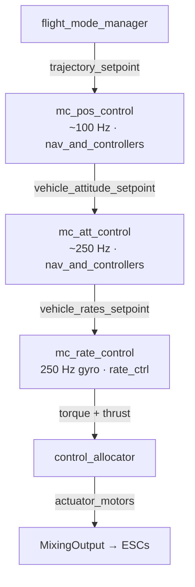
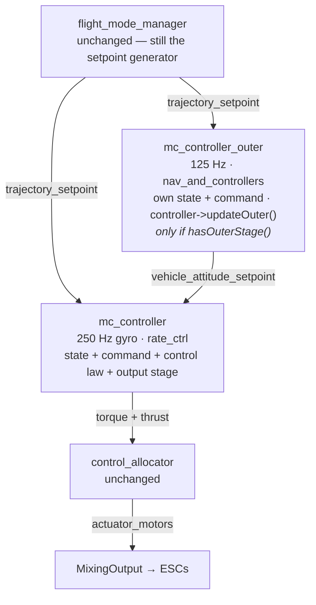
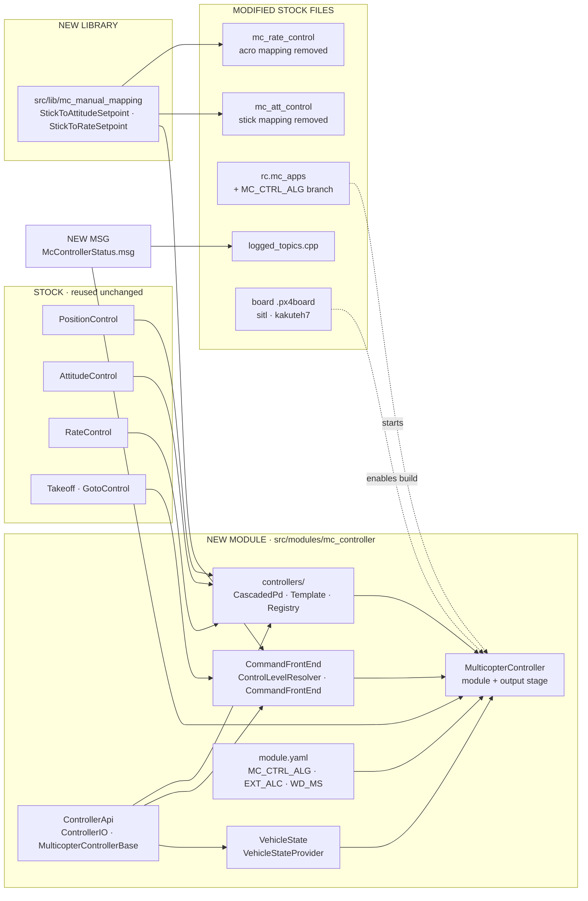
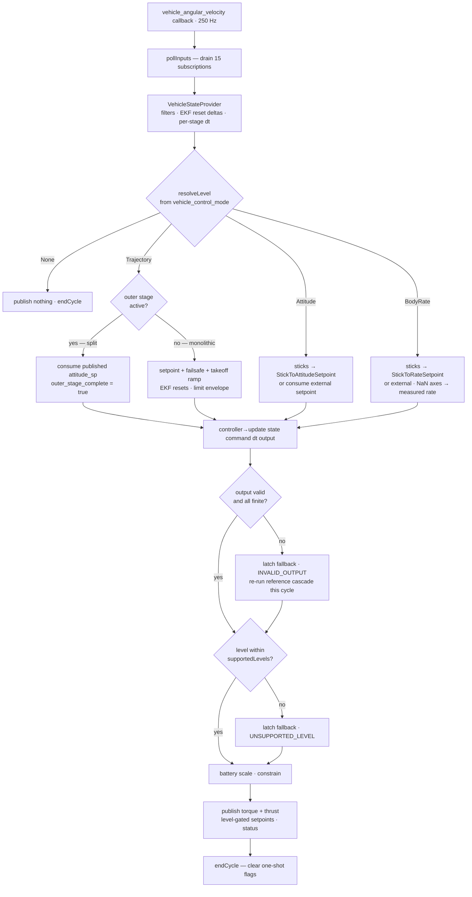
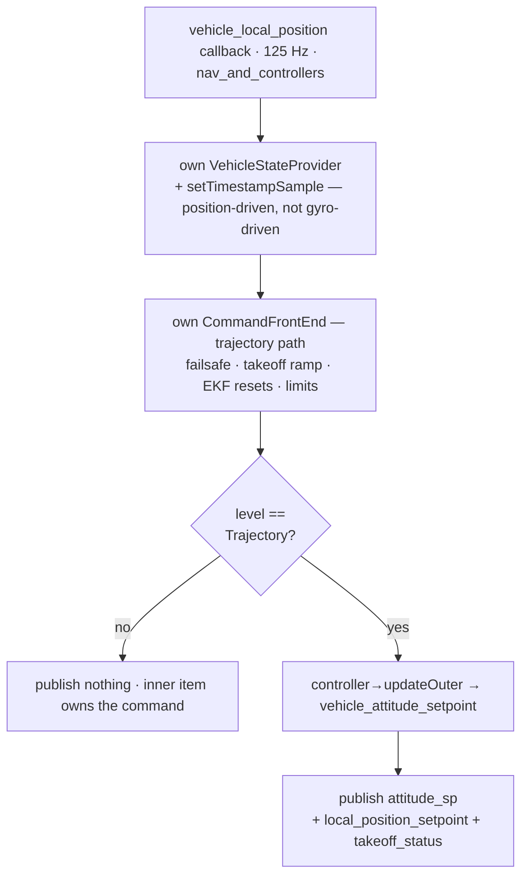
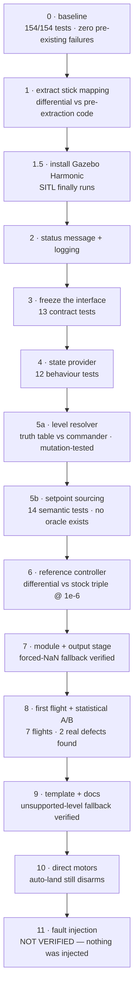

# mc_controller — visual change map

Companion to [ARCHITECTURE.md](ARCHITECTURE.md). Four diagrams: the architecture
before and after, every file touched, one control cycle, and the build order.

Legend used throughout:

| | meaning |
|---|---|
| **teal / solid** | new code |
| **ochre** | existing PX4 file that was modified |
| **outlined** | stock code reused unchanged |
| **red** | unverified |

---

## 1. The architectural change

Stock PX4 flies a multicopter through three separate modules chained over uORB,
each driven by a different sensor callback on two different work queues. The
control laws inside them are plain classes with **no virtual methods**, and the
mode gating that decides which loop runs is split across all three files. That is
what made swapping in a new controller a fork rather than a plug-in.

### Before — `MC_CTRL_ALG = 0` (still the default)

### After — `MC_CTRL_ALG >= 1`

**Work-queue placement** (Stage 12 restored stock's separation, opt-in per
controller via `hasOuterStage()`):

| | `rate_ctrl` (high priority) | `nav_and_controllers` |
|---|---|---|
| stock | `mc_rate_control` 250 Hz | `mc_att_control` 250 Hz, `mc_pos_control` 125 Hz |
| framework, split | `mc_controller` 250 Hz | `mc_controller_outer` 125 Hz |
| framework, monolithic | `mc_controller` 250 Hz — *whole law* | idle |

A monolithic controller keeps `hasOuterStage()` false and runs entirely on
`rate_ctrl`, because a law whose stages share state cannot be cut across two
threads. `updateOuter()` and `update()` run **concurrently on the same object**
and must touch disjoint members; everything that crosses goes through the
published `vehicle_attitude_setpoint`.

> **Two real behavioural differences from stock.**
>
> 1. **Attitude stage placement.** Stock runs the attitude loop on
>    `nav_and_controllers`; the framework runs it on `rate_ctrl` beside the rate
>    loop. Deliberate — the quaternion P law is cheap, and co-locating it removes
>    a uORB hop of latency from the fast cascade, while the expensive
>    `PositionControl` math is what actually needed to move off `rate_ctrl`.
>    Matching stock exactly would need a third work item.
> 2. **In monolithic mode the attitude→rate uORB hop disappears entirely**
>    (~one cycle less latency than stock). Invisible to the unit tests, which run
>    both sides in one process.
>
> The Stage 8 and Stage 12 statistical A/Bs found no torque, thrust or rate-setpoint
> signal outside run-to-run noise, so any effect is below the measurement floor.

---

## 2. The change map — every file touched

Arrows are "depends on / feeds". The three stock control laws are **reused**, not
reimplemented — that is what makes the reference controller a trustworthy baseline.

### What each modification does

| path | | what it does |
|---|---|---|
| `src/lib/mc_manual_mapping/` | new | RC stick → setpoint mappings, lifted verbatim out of the two stock modules so there is exactly one copy. Prevents the framework and stock drifting apart on throttle curves and spool-up gating, which are safety behaviour. |
| `ControllerApi/` | new | The frozen contract: `ControllerState`, `ControllerCommand`, `ControllerOutput`, abstract base class. Outputs default to NaN and `valid = false`, so a controller that forgets to write its output is rejected rather than commanding zero torque. |
| `VehicleState/` | new | EKF topics → one state struct: velocity notch/low-pass/derivative chain, per-axis NaN validity, EKF reset deltas as one-shot signals, per-stage `dt` so each stage keeps its stock rate. |
| `CommandFrontEnd/` | new | Normalises RC / mission / offboard into one command tagged with a control level, and owns the safety policy: takeoff ramp, two-stage failsafe, EKF-reset application, on-ground override, limit envelope. |
| `controllers/` | new | Reference cascade (wraps the stock laws — the A/B baseline), a template to copy, and the `MC_CTRL_ALG` switch. |
| `MulticopterController.cpp` | new | The module and the inner work item. Drains 15 subscriptions, runs the pipeline at gyro rate, and owns the output stage — the real safety boundary. |
| `OuterLoop.cpp` | new | Second work item on `nav_and_controllers`, driven by `vehicle_local_position`, active only when the controller reports `hasOuterStage()`. Restores stock's queue separation so heavy trajectory math stays off the gyro path. Owns its **own** state provider and front end — sharing them with the inner item would be a cross-queue data race. |
| `msg/McControllerStatus.msg` | new | Diagnostics: algorithm, control level, fallback state and reason, per-stage `dt`, invalid-output counter, free `debug[8]`. |
| `mc_att_control` | mod | Stick→attitude mapping deleted, replaced by a call into the shared library. Behaviour unchanged — proven bit-for-bit. |
| `mc_rate_control` | mod | Same for the Acro mapping. Together these two edits are **−205 / +19 lines**: a pure relocation. |
| `rc.mc_apps` | mod | Boot branch on `MC_CTRL_ALG`. Uses `param greater -s` so a missing parameter fails *silently* — a build without the module always falls back to stock. |
| `logged_topics.cpp` | mod | Logs the status topic as *optional*, so stock builds that never advertise it don't warn. |
| `*.px4board` | mod | Builds the module for SITL and the Kakute H7. The Kconfig `select`s the three stock MC modules — load-bearing, since the reused control laws and the `MPC_*`/`MC_*` parameters only exist when their owning module is enabled. |

---

## 3. One control cycle, 250 times a second

The gyro callback drives everything. Note where the two fallback triggers sit: an
invalid output re-runs the fallback controller **in the same cycle**, so the vehicle
is never left without a command. Since `MC_CTRL_ALG=1` became an independent
cascaded PD law, that fallback *is* the PD law rather than anything stock-derived —
reaching the stock cascade requires `MC_CTRL_ALG=0` and a reboot.

And, concurrently, when the controller opts into the outer stage:

The fallback latch is **sticky for the whole armed period**, cleared only on the
disarm transition. A NaN means corrupted internal state; retrying next cycle would
produce a limit cycle alternating between garbage and fallback.

**Publication is level-gated to mirror stock.** Each intermediate topic is
published only in the modes where the stock module owning it actually runs, and
only by the item that generated it — `vehicle_local_position_setpoint` at
`Trajectory` only, from `OuterLoop` when split and from the output stage when
monolithic. Stage 12 found this ungated: the framework published a held position
setpoint through Stabilized, which flight tasks read as a stale reset origin and
which faked a 12× altitude-tracking regression in log analysis.

---

## 4. Build order — bottom-up, gated at every step

Each stage had to pass a build on both SITL **and** the flight board, a smoke test
of the new component, and a regression check that nothing already working had
broken — before the next stage started.

Final state: **161/161 tests pass**, both builds clean, `MC_CTRL_ALG` defaults to
`0` so nothing changes until deliberately enabled.

### Defects the gates caught

| stage | defect | why it mattered |
|---|---|---|
| 8 | Trajectory yaw feed-forward dropped — the attitude stage was passed `0` instead of the commanded yaw rate | Yaw lagged on every heading change. Fixing it moved every rate setpoint from 5–8% error to within 1.2–2.0% of stock. |
| 8 | `vehicle_rates_setpoint` and `vehicle_attitude_setpoint` never published at all | Silently breaks WeatherVane, the gimbal stream, mavlink telemetry and QGC. |
| 7 | Fallback latch cleared on *level* rather than the disarm *edge* | The documented "sticky for the armed period" guarantee silently didn't hold, and it logged at 250 Hz on the bench. |
| 7 | `%u` against a `uint32_t` — fine on x86, fatal on 32-bit ARM | Compiled cleanly for SITL and broke the Kakute H7 build. A SITL-only workflow would have shipped it. |
| 12 | Outer item passed `now = 0` — `timestamp_sample` is written by `updateAngularVelocity()`, never called on a position-driven item | The takeoff state machine read 0 as "now", never left rampup, pinned thrust at −0.001. **The vehicle never left the ground.** |
| 12 | `vehicle_local_position_setpoint` published in *every* mode, and by *both* work items in split mode | Stock publishes it only while `mc_pos_control` runs. The framework published a held setpoint through Stabilized — a stale reset origin for the flight tasks, and it faked a 12× altitude-tracking regression that cost real time to chase down. |
| 12 | The manual throttle curve never received the live hover-thrust estimate — stock wires it at `mc_att_control_main.cpp:119`, the framework wired only the `PositionControl` consumer | **21% collective error in Stabilized** (commanded exactly `MPC_THR_HOVER` = 0.60 against stock's 0.7257). On hardware a pilot switching to Stabilized would meet a sudden collective drop and sink. The whole-window A/B reported this as 1.9% — nearly the noise floor — because Stabilized is 15 s of 66 s. |

> **The most important thing the A/B found.** The yaw feed-forward defect passed
> straight through the Stage 6 differential test — the one that agrees to 1e-6 —
> because the hand-wired reference twin in that test contained the same mistake. A
> twin written by the same author reproduces that author's misunderstanding, so
> bit-exact agreement only proved two copies of one wrong idea matched. Flying
> against the *real* stock modules was not redundant.

> **Three times a green result wasn't evidence.** A stick sweep that printed
> "complete" while the mode never engaged. A NaN latch that passed every assertion
> while re-firing every cycle. A rotor failure that was never injected, in two runs
> that both reported success. For fault-tolerance comparisons the lesson transfers
> directly: **verify from the ULog that the failure actually happened** before
> believing any A/B.

> **Comparing values is not comparing behaviour.** Stage 8 and Stage 12 both
> compared *signal magnitudes* — torque, thrust, rate setpoints — and both passed.
> Neither could see a topic being published in the wrong flight mode, because the
> numbers in it looked entirely plausible. The gate that catches this class asks a
> different question: **which topics are published in which modes**, counted per
> control-level segment and diffed against stock. A value-only comparison will
> never find a publication defect.

> **And a whole-flight aggregate can hide a large error in one mode.** The same A/B
> reported `thrust z` at 1.9%, barely above noise. It was a **21% collective error
> in Stabilized**, averaged down because Stabilized was 15 s of a 66 s window and the
> other 77% was correct. Analyse per flight mode, always — the aggregate both
> inflates artifacts (the phantom 12× above) and dilutes real defects.

---

## 5. Still unverified

| item | why | how to close it |
|---|---|---|
| Real hardware | Nothing has run on the Kakute H7 beyond compiling | Bench disarmed → `mc_controller status`, `work_queue status`, `perf` → tethered STAB hover → ALTCTL → POSCTL |
| Fault-injection equivalence | The injection never applied — command accepted, no motor stopped | `SYS_FAILURE_EN=1` → `param save` → **reboot** → inject. Or test your own `kill_switch_2` with the transmitter |
| Acro / BodyRate in flight | Deliberately skipped — scripted acro has high crash risk and the mapping is already proven bit-exact | Fly it manually |
| Armed `actuator_motors` rate | The 10 Hz measured was the logger's downsample, not the publication rate | `uorb top` while armed |
| Inner-loop cycle time | **Not measurable in SITL** — every `PC_ELAPSED` counter reports `0us elapsed`, for the stock modules too | Hardware only: `perf` → `mc_controller: cycle` against the 2.5 ms budget at `IMU_GYRO_RATEMAX=400` |
| Outer-stage concurrency | The disjoint-state contract between `updateOuter()` and `update()` is enforced by review, not by the compiler | No shipped controller opts in today; audit any new controller that does |
